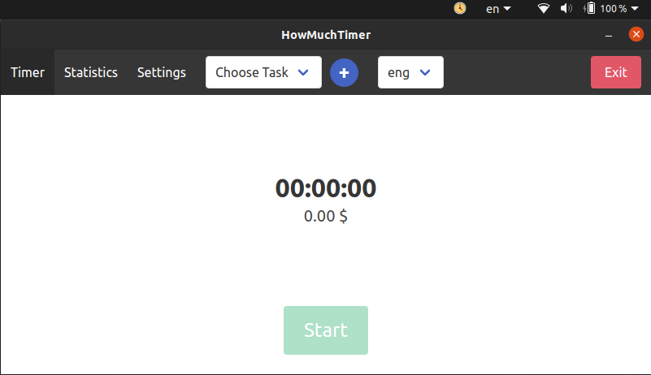
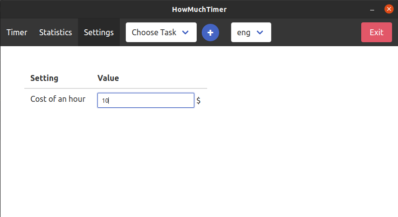
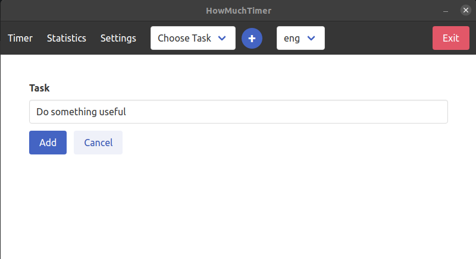
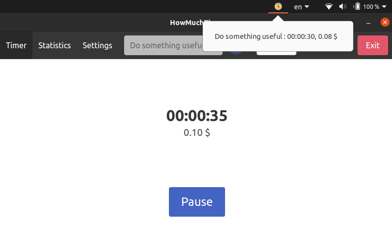
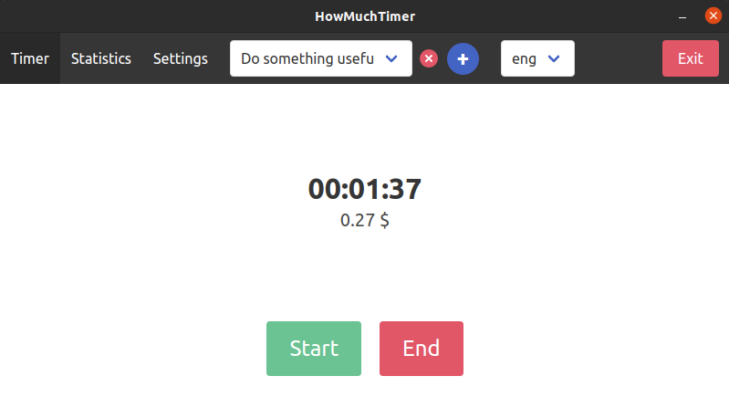
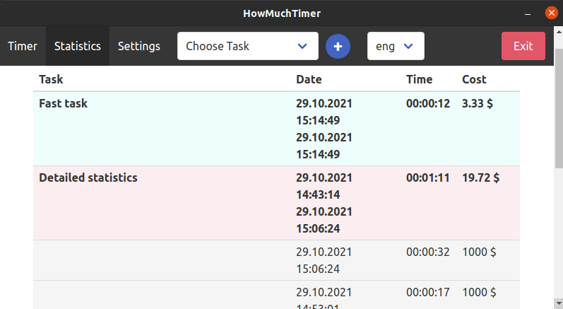
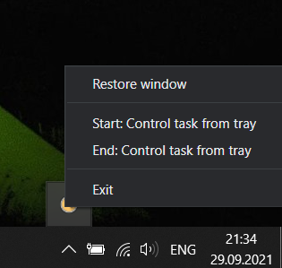

# HowMuchTimer
Customizable developer timer to track time spent and money earned. Available in multiple languages.

## Installation
### Deb package
Link: [https://github.com/developmentoffice/HowMuchTimer/releases/download/v1.1.0/howmuchtimer-1.1.0-amd64.deb](https://github.com/developmentoffice/HowMuchTimer/releases/download/v1.1.0/howmuchtimer-1.1.0-amd64.deb)

```bash
wget https://github.com/developmentoffice/HowMuchTimer/releases/download/v1.0.0/howmuchtimer-1.0.0-amd64.deb
sudo dpkg -i howmuchtimer-1.0.0-amd64.deb
howmuchtimer
```

### Windows
Link: [https://github.com/developmentoffice/HowMuchTimer/releases/download/v1.0.0/howmuchtimer-1.0.0-win.exe](https://github.com/developmentoffice/HowMuchTimer/releases/download/v1.0.0/howmuchtimer-1.0.0-win.exe)

## Screenshots
### Main screen


### Settings


### Add task


### Start timer


### Stop timer


### Statistics


### Control active task from tray (windows only)



## Remove (debian)
```bash
sudo dpkg -P howmuchtimer
```

## Development
`npm start` - run the main process

`npm run renderer_watch` - watch renderer files

`npm run renderer_build` - build renderer script

`npm run make` - make binary

## License
[MIT](https://opensource.org/licenses/MIT)

Copyright (c) 2021, Alex Novikov
